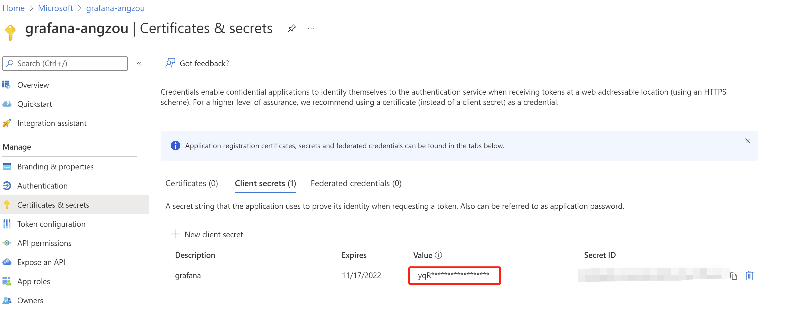
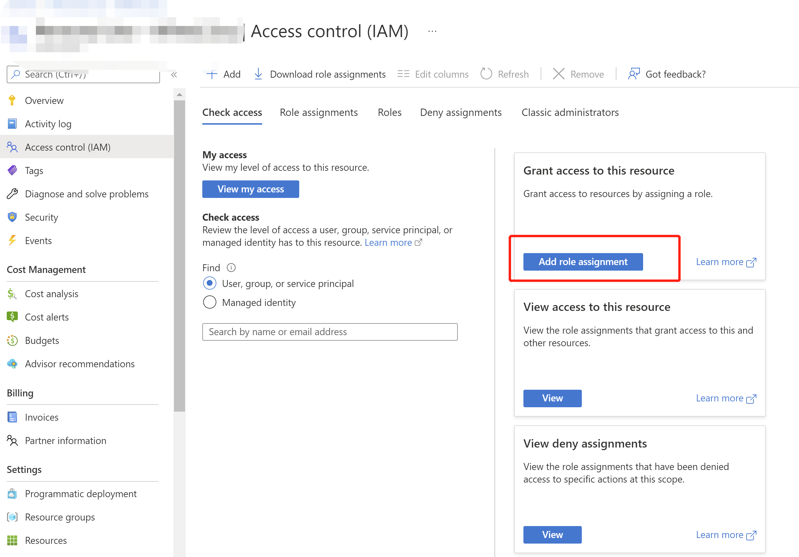
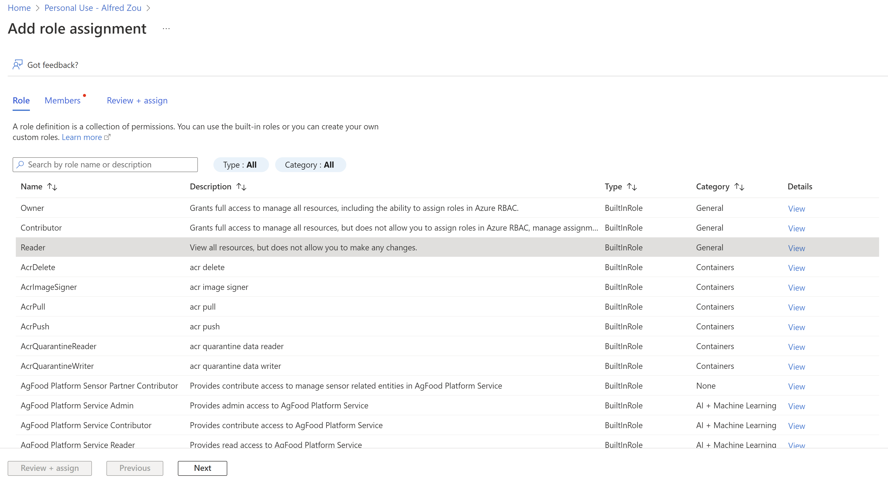
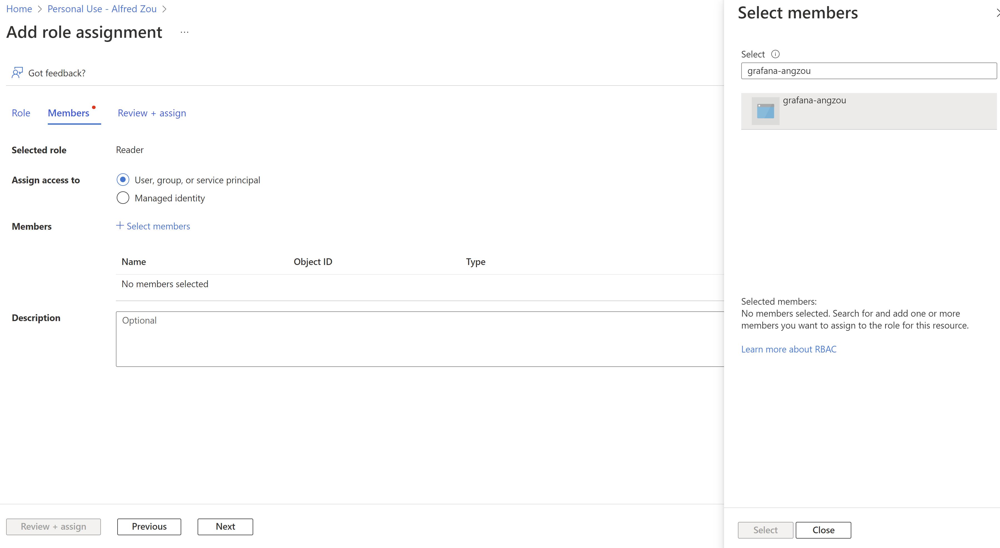
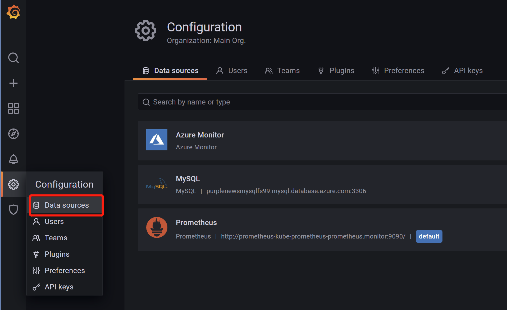
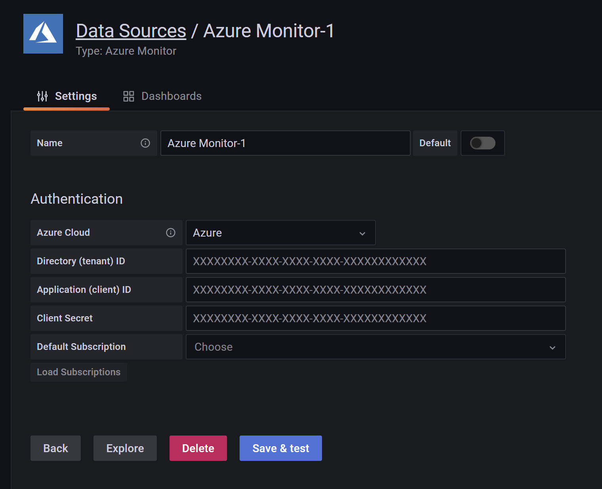
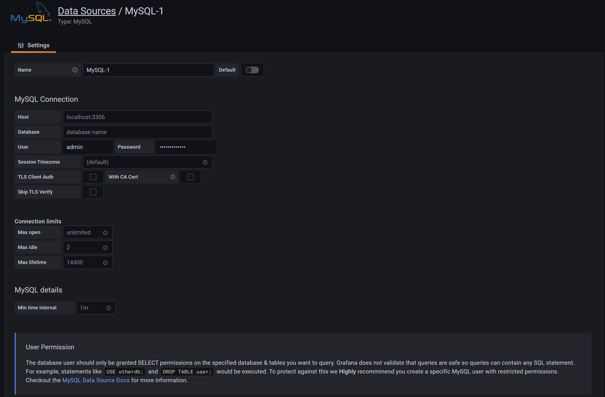

# Monitor Azure MySQL Flexible Server with AKS and Grafana

## Overview

The whole solution includes these components:

* [Azure Kubernetes Service](https://docs.microsoft.com/en-us/azure/aks/intro-kubernetes)
* [Azure Virtual Network](https://docs.microsoft.com/en-us/azure/virtual-network/virtual-networks-overview)
* [Azure Database for MySQL Flexible Server](https://docs.microsoft.com/en-us/azure/mysql/flexible-server/overview)
* [Private DNS Zones](https://docs.microsoft.com/en-us/azure/dns/private-dns-privatednszone)
* [Prometheus](https://prometheus.io/docs/introduction/overview/)
* [Grafana](https://grafana.com/)
* [Helm](https://helm.sh/)


### Prometheus
Prometheus is an open source system for monitoring and alerting. This was initially developed at SoundCloud in 2012. For this system developers of the prometheus takes the inspiration of Googles Borgmon. In Prometheus it uses multidimensional time series data model for metrics and events. Following are the key features of prometheus.

Following are the main components of Prometheus

* [Prometheus server](https://github.com/prometheus/prometheus)
* [Client libraries](https://prometheus.io/docs/instrumenting/clientlibs/)
* [Push gateway](https://github.com/prometheus/pushgateway)
* [Exporters](https://prometheus.io/docs/instrumenting/exporters/)
* [Alertmanager](https://github.com/prometheus/alertmanager)
* various support tools

Following is the architecture of the Prometheus


### Grafana
Grafana is an Open Source data visualization tool. We can connect different data sources to grafana and create meaningful, rich dashboard for different workloads. In grafana we can connect different data sources like prometheus, inflexDB, Elasticsearch, Azure logs, collectd.


## Prepare Virtual Networks

First we need to create two VNets to deploy Kubernetes Cluster and MySQL Instance. You can create one VNet if you like.

Open Azure Cloud Shell at [Azure Cloud Shell](https://shell.azure.com/)
Use following script

```bash
location="East US"
resourceGroup="my-demo-rg"
tag="demo"
vNet1="kubernetes-vnet"
vNet1addressPrefix="10.0.0.0/16"
vNet1subnet="kubernetes-subnet"
vNet1subnetPrefix="10.0.0.0/24"

vNet2="mysql-vnet"
vNet2addressPrefix="10.1.0.0/16"
vNet2subnet="mysql-subnet"
vNet2subnetPrefix="10.1.0.0/24"

echo "Creating $resourceGroup in $location..."
az group create --name $resourceGroup --location "$location" --tags $tag

# Create a virtual network and a subnet for kubernetes cluster.
echo "Creating $vNet1 and $vNet1subnet"
az network vnet create --resource-group $resourceGroup --name $vNet1 --address-prefix $vNet1addressPrefix  --location "$location" --subnet-name $vNet1subnet --subnet-prefix $vNet1subnetPrefix

# Create a virtual network and a subnet for mysql cluster.
echo "Creating $vNet2 and $vNet2subnet"
az network vnet create --resource-group $resourceGroup --name $vNet2 --address-prefix $vNet2addressPrefix  --location "$location" --subnet-name $vNet2subnet --subnet-prefix $vNet2subnetPrefix

# Get the ID of VNet1
echo "Getting the id for $vNet1"
VNet1Id=$(az network vnet show --resource-group $resourceGroup --name $vNet1 --query id --out tsv)

#Get the ID of VNet2
echo "Getting the id for $vNet2"
VNet2Id=$(az network vnet show --resource-group $resourceGroup --name $vNet2 --query id --out tsv)

# Peer VNet1 to VNet2.
echo "Peering $vNet1 to $vNet2"
az network vnet peering create --name "Link"$vNet1"To"$vNet2 --resource-group $resourceGroup --vnet-name $vNet1 --remote-vnet $VNet2Id --allow-vnet-access

# Peer VNet2 to VNet1.
echo "Peering $vNet2 to $vNet1"
az network vnet peering create --name "Link"$vNet2"To"$vNet1 --resource-group $resourceGroup --vnet-name $vNet2 --remote-vnet $VNet1Id --allow-vnet-access

```

## Deploy Kubernetes Cluster and MySQL Flexible Server
Use following script or you can do it in [Azure Portal](https://ms.portal.azure.com/#home).

```bash
location="East US"
resourceGroup="my-demo-rg"
clusterName="myAKSCluster"
vNet1="kubernetes-vnet"
dockerBridgeAddress="172.17.0.1/16"
serviceCidr="10.100.0.0/24"

vNet2="mysql-vnet"
mysqlName="demoMySQL"
privateDNS="testDNS.private.mysql.database.azure.com"

# Get kubernetes node subnet id
nodeSubnetId = $(az network vnet subnet list \
    --resource-group $resourceGroup \
    --vnet-name $vNet1 \
    --query "[0].id" --output tsv)
# Get kubernetes pod subnet id
podSubnetId = $(az network vnet subnet list \
    --resource-group $resourceGroup \
    --vnet-name $vNet1 \
    --query "[1].id" --output tsv)

# Create AKS Cluster
az aks create -n $clusterName -g $resourceGroup -l $location -n aksnodepool --max-pods 250 --node-count 3 --network-plugin azure --vnet-subnet-id $nodeSubnetId --pod-subnet-id $podSubnetId --docker-bridge-address $dockerBridgeAddress --service-cidr $serviceCidr --generate-ssh-keys


# Create private dns zone
az network private-dns zone create -g $resourceGroup -n $privateDNS

#Get VNet Id
vNet1Id = $(az network vnet list --resource-group $resourceGroup --query "[?contains(name,'$vNet1')].id" --output tsv)

# Link private dns zone to kubernetes vnet
az network private-dns link vnet create -g $resourceGroup -n privateDNSLink -z $privateDNS  -v $vNet1Id -e False

# Create MySQL Flexible Server

mysqlSubnetId = $(az network vnet subnet list --resource-group $resourceGroup --vnet-name $vNet2 --query "[0].id" --output tsv)

privateDNSZoneId = $(az network private-dns zone list -g $resourceGroup --query "[0].id" --output tsv)

# az mysql flexible-server create --resource-group $resourceGroup --name $mysqlName --location $location --subnet $mysqlSubnetId --private-dns-zone $privateDNSZoneId

az mysql flexible-server create --resource-group $resourceGroup --name $clusterName --vnet $vNet2 --subnet $mysqlSubnetId --location $location --private-dns-zone $privateDNSZoneId
```

## Deploy Prometheus and Grafana
Open [Cloud Shell](https://shell.azure.com) or the Azure CLI.

```bash
resourceGroup="my-demo-rg"
clusterName="myAKSCluster"

subscriptionId = $(az account show --query "id" --output tsv)

az aks get-credentials --resource-group $resourceGroup --name $clusterName

helm repo add stable https://charts.helm.sh/stable

kubectl create ns monitoring

helm install prometheus stable/prometheus-operator --namespace monitoring
```

First, use your **LOCAL PC**, use following command
```bash
kubectl get pod -n monitoring|grep grafana
```

Use following command
```bash
kubectl port-forward --namespace monitoring svc/prometheus-grafana 8080:80
```

Open [http://localhost:8080](http://localhost:8080) in your **LOCAL PC**, Use **admin/prom-operator** as default username and password.


## Manage Grafana Datasources

### Create App registration for Grafana
Go to [Azure portal](https://portal.azure.com), search *Azure Active Directory*.


Click on **App registrations**, click **New registration**


Use following parameters

| Parameter | Value |
| :----------|:------|
| Name      | grafana|
| Supported account types| Accounts in this organizational directory only|
|Redirect URI| use default value|
|Service Tree ID| use default value|


Go to the new application registered.

Copy **Application (client) ID** and **Directory (tenant) ID** to your notepad, we will need them later.

Go to **Certificates & secrets**, click on **New client secret**



Copy the Value when secret is added. It will only show **ONCE**, so make sure you copy the secret to notepad.

Go to your scription page, select **Access Control(IAM)**, click **Add role assignment**



Select **Reader** and **Monitor Reader** in Role page. Click Next.



Select your application in Members page.



Click **Next** and **Review + assign**

### Create Azure Monitor DataSource

Go to Grafana dashboard at [http://localhost:8080](http://localhost:8080).



Click on **Add data source**, choose **Azure Monitor**


Use following parameters:
|Parameter| Value Description|
|--------|:--------|
|Azure Cloud| Azure|
|Directory (tenant) ID| Tenant id copied from App registration overview page|
|Application (client) ID| Client id copied from App registration overview page|
|Client Secret| Secret value copied when create new certificate|

Click **Load Subscriptions** and choose the default subscription. Click **Save & test**.

### Create MySQL Datasource
Click **Data sources** on the left navigator of Grafana, click **Add data source**, choose **MySQL**

Use following parameters:
|Parameter|Value|
|-------|:------|
|Host| Copy host name from MySQL flexible server page|
|Database| performance_schema|
|User| Create a readonly user account, don't use admin|
|Password| user password |

Leave the rest parameters as default.

## Import MySQL Monitor Dashboard


Use the Code **16311**


Open the dashboard and choose the database you wish to monitor.


